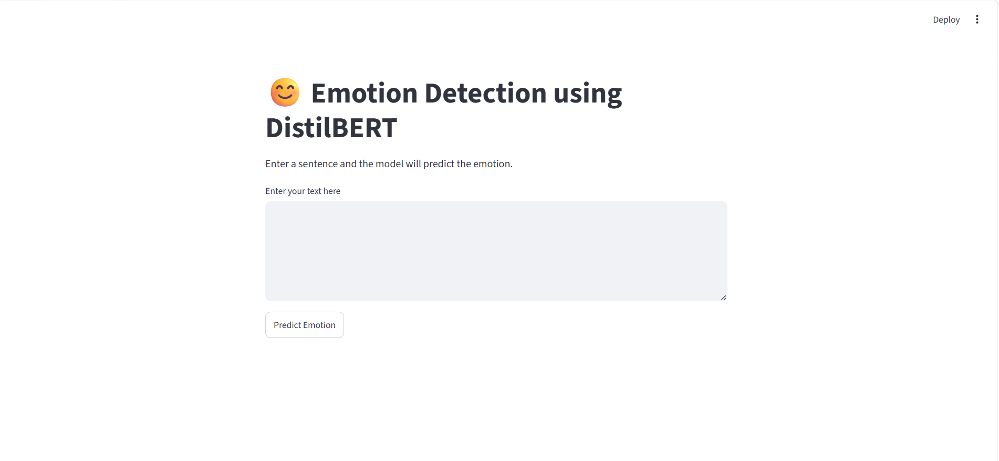
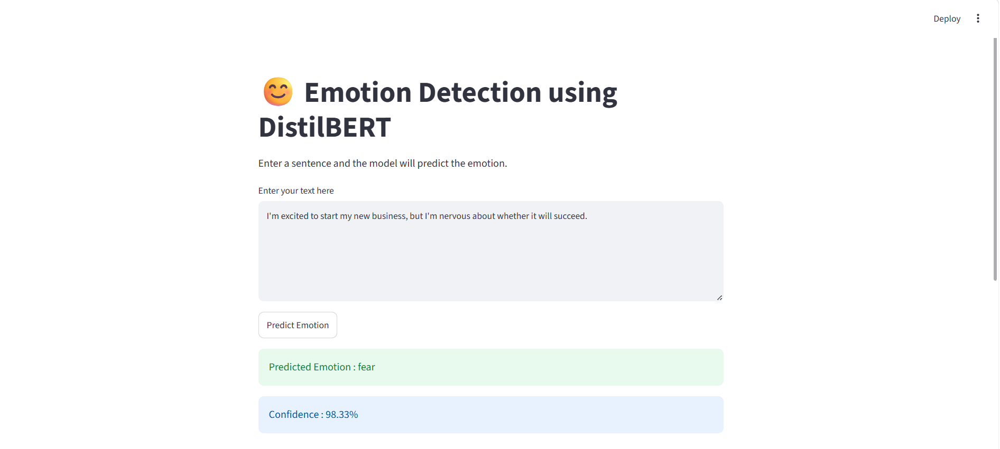
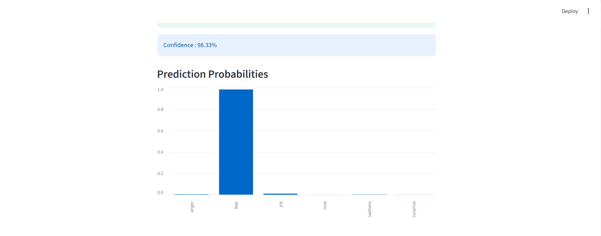

# Emotions_Detection_Using_DL

## 📌 Project Overview

This project is an end-to-end Emotion Detection application built using **DistilBERT**, a lightweight transformer model from Hugging Face. The model classifies user-entered text into one of six emotions and provides confidence scores along with probability distributions through an interactive Streamlit web application.

---

## Web Page







## 🚀 Features

- Fine-tuned DistilBERT model for emotion classification
- Real-time emotion prediction
- Text preprocessing pipeline
- Confidence score for predictions
- Emotion probability distribution
- Interactive Streamlit web application
- Modern and user-friendly interface

---

## 🎯 Emotion Classes

- 😊 Joy
- ❤️ Love
- 😢 Sadness
- 😨 Fear
- 😡 Anger
- 😲 Surprise

---

## 📊 Model Performance

The DistilBERT model achieved the best performance among all experimented deep learning models.

| Model | Accuracy |
|--------|----------|
| Simple RNN | 0.90 |
| LSTM | 0.91 |
| GRU | 0.91 |
| Bi-LSTM | 0.91 |
| BERT | 0.93 |
| **DistilBERT** | **0.94** |

*(Update the values if your final results are different.)*

---

## 🛠 Tech Stack

- Python
- PyTorch
- Hugging Face Transformers
- Streamlit
- Scikit-learn
- Pandas
- NumPy
- Joblib

---

## 📂 Project Structure

```
Emotion-Detection-Using-DistilBERT/
│
├── app.py
├── requirements.txt
├── README.md
├── label_encoder.pkl
├── model/
│   ├── config.json
│   ├── model.safetensors
│   ├── tokenizer.json
│   └── tokenizer_config.json
│
├── Emotions_Detection_Using_DL.ipynb
│
├── web_page.png
├── web_page_result1.png
└── web_page_result2.png
```


---

## 💡 Sample Inputs

### Joy

```
I got promoted today and I couldn't be happier.
```

### Sadness

```
I miss my best friend every day.
```

### Anger

```
I am extremely angry because nobody listened to me.
```

### Fear

```
I am terrified of losing my family.
```

### Love

```
I love spending time with my parents.
```

### Surprise

```
I can't believe I won the competition.
```

---

## 📈 Workflow

```
User Input
      │
      ▼
Text Preprocessing
      │
      ▼
DistilBERT Tokenizer
      │
      ▼
Fine-tuned DistilBERT Model
      │
      ▼
Emotion Prediction
      │
      ▼
Confidence Score
      │
      ▼
Visualization using Streamlit
```

---

## 📌 Future Improvements

- Multi-label emotion detection
- Voice emotion recognition
- Explainable AI (XAI)
- Sentiment + Emotion Analysis
- REST API deployment
- Docker support

---


## ⭐ If you found this project useful, consider giving it a Star!
